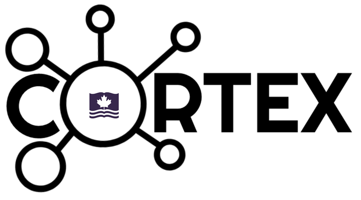
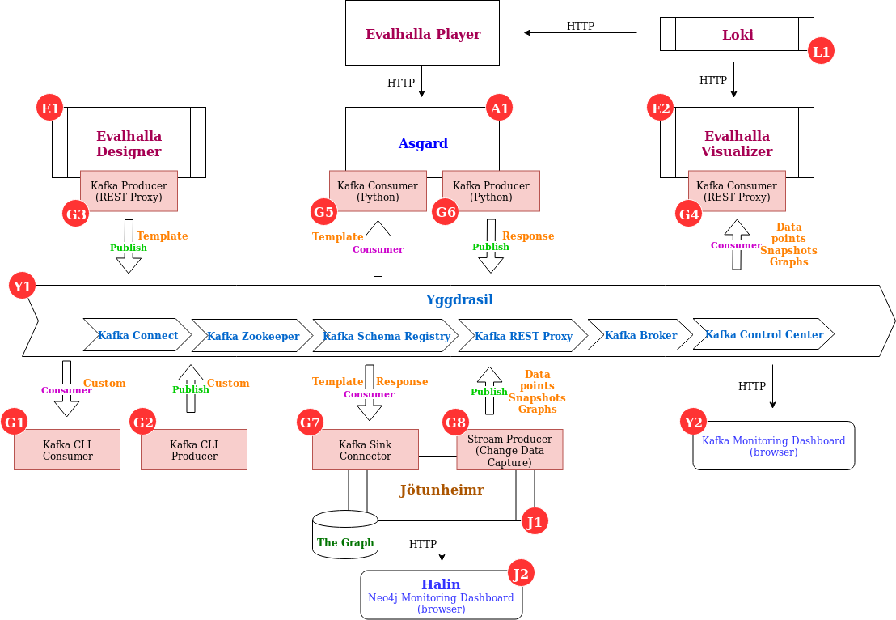

# CORTEX

## CORTEX - Data for People
- No siloes. Data can be streamed to whomever need it, whenever they need it.
- Infrastructure to collect, process, distribute to those who need the data, then embedding intelligence into that.
- Being able to see how the daily interactions and modifications to the data change things in the moment.

## MVP 1 diagram

## Work in progress

[***CORTEX MVP***](cortex_mvp.html)
