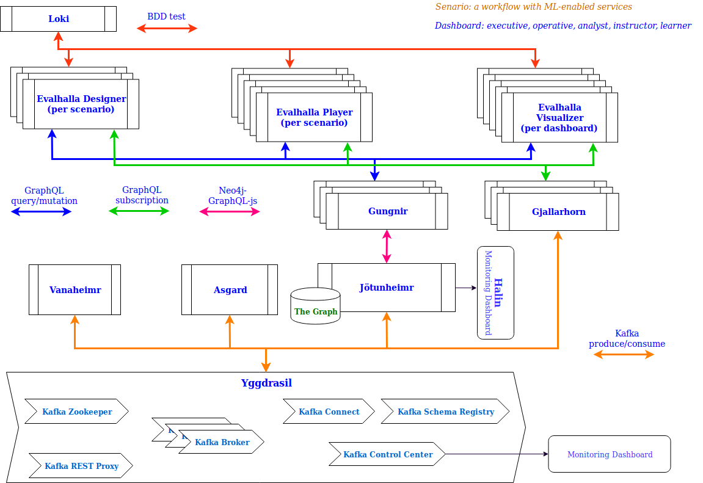
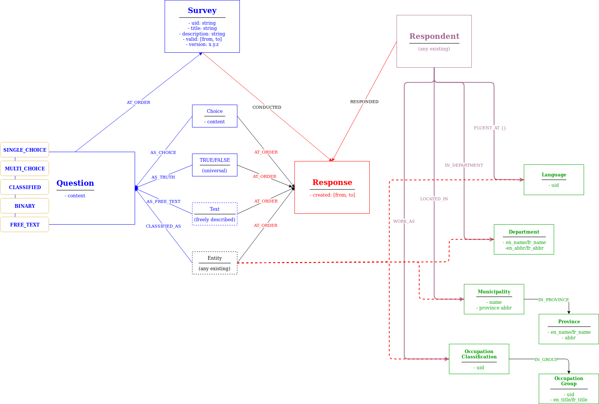
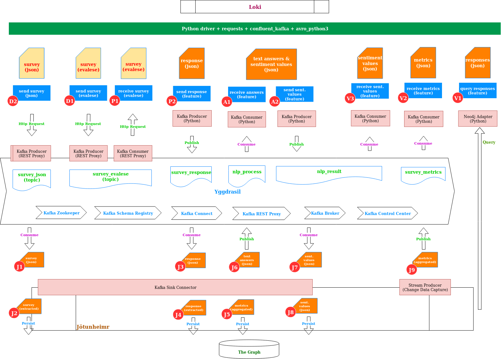

## A. Brief description
- No siloes. Data can be streamed to whomever need it, whenever they need it.
- Infrastructure to collect, process, distribute to those who need the data, then embedding intelligence into that.
- Being able to see how the daily interactions and modifications to the data change things in the moment.

## B. Current Progress

[CLICK ME]( http://htmlpreview.github.io/?https://github.com/DIS-SIN/CORTEX/blob/master/cortex_mvp.html)

## C. MVP diagram

## D. MVP data models

- blue nodes & relationships created by EValhalla Designer - the `survey`
- red nodes & relationships created by EValhalla Player - the `response`
- `Respondent` entity is created by EValhalla Player if it does not exists
- meta data inside `question` with `classified`-type `answer` will help to decide to `enrich` the `Respondent` with known entities or let them belong to the `response` as usual.
- other data entity types are not added

## E. BDD test scenarios

## F. Notes

## mjolnir - tool for large data import
Completed harvesting, normalization, and configuration for basic reference datasets to be imported into Jotunheimr via Yggdrasil:
+ Postal Code v2015 (Municipality, Community, Postal Code, Geo-Location, Province)
+ GoC Departments and Organizations from GEDS v2019 (en/fr names, abbreviations, sub-organization structure, locations)
+ GoC Occupation Classifications v2019 (occupation groups/sub-groups, classifications, levels)
